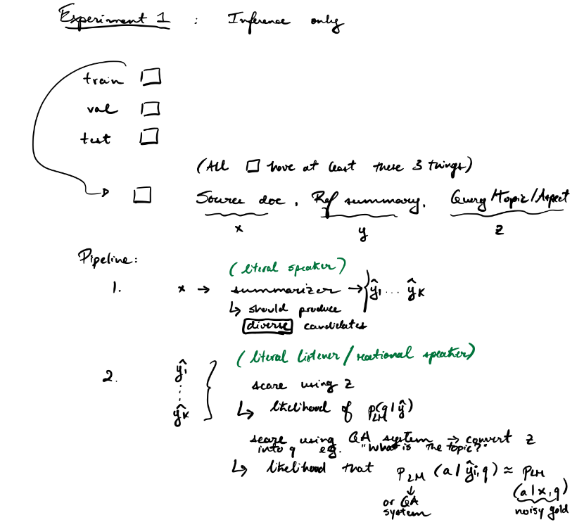

# RSASumm

Can we use RSA for Summ(arization)?

# Outline of work

## 1. Find datasets

- DUC: Specifically, the years with query-focused summarization (2006/2007).
- TAC: Same comment as above.
- Debatepedia (2017):
    - Description: Extracted from Debatepedia a list of triples of D-Q-S.
    - Link: https://github.com/PrekshaNema25/DiverstiyBasedAttentionMechanism/tree/master
    - Comment: It appears that some of the tiples in this dataset are of low quality. This paper https://arxiv.org/pdf/2305.06147.pdf tries to fix that by using ChatGPT to filter incorrect triples.
- MARGE (2021):
    - Link: https://github.com/yumoxu/marge, requires regeneration.
- MA-News (2019)
    - Link: https://github.com/ColiLea/aspect_based_summarization, but ask you to regenerate it.
- AQuaMuse (2020)
    - Description: Automatically generated dataset where a subset of (question/long answer) pairs from Google's Open Domain QA dataset are matched with *multiple* documents scraped from common crawl web repository.
- QMSum (2021)
    - Description: Query-based meeting summarization dataset. The input document is the whole meeting transcript then there are annotated generic summaries as well as annotated topic-based summaries. Importantly, there are also the annotations of which portions of the transcript are useful for summarizing the transcript for some particular topic.
    - Link: https://github.com/Yale-LILY/QMSum
- WikiAsp (2021)
    - Description: Similar to OASum in that it is automatically generated aspect-based summarization dataset using Wikipedia articles. In this case, they take each section of a Wikipedia article, filter it down and use the documents that are cited by that section as the source documents.
    - Link: https://github.com/neulab/wikiasp
- MultiOpEd (2021)
    - Description: This dataset is scraped from an editorial board with two constrasting takes to a given query. For each query, there are 2 editorials with different opinions, 2 abstracts (one for each editorial) and 2 high-level takeways (which the authors call *perspectives*).
    - Comments: Articles are in general pretty long but this seems to be a dataset that aligns with what you want to do.
    - Link: https://github.com/CogComp/MultiOpEd
- NEWSTS (2022)
    - Description: Annotate a subset of CNN/DM by using MTurkers to create two reference summaries for each article, each focused on some topic.
    - Link: https://aclanthology.org/2022.findings-acl.42.pdf
- CovidET (2022)
    - Description: Given a Covid-19-related Reddit post, annotators are asked to summarize them with a particular emotion in mind.
    - Comments: Reddit posts are relatively short, so could fit within context-window.
    - Link: https://github.com/honglizhan/CovidET
- SQuALITY (2022)
    - Description: Given a short-story ask **human annotators** to write summaries of the short-story. They get 1 general summary and 4 query-focused summaries. 
    - Comments: They note that automatic evaluation metrics correlate poorly with human judgements. Also, the input documents are quite long so should probably not start with these documents if want to test pre-trained LLMs only (they only explored fine-tuning). **This would be a good dataset to explore in the future since it's very high quality.**
    - Link: https://github.com/nyu-mll/SQuALITY
- OASum (2023)
    - Description: Given a Wikipedia page, the abstract of the Wikiepedia page can be seen as a multi-aspect summary of the entire Wikipedia article where one aspect relates to the topic of a section. The soruce document(s) (from one Wikipedia page) are the subsections and the reference summary is the filtered down abstract based on some ROUGE-based heuristic on its similarity to that section.
    - Comments: These summaries are still ill-defined but "less" than generic summaries. This is because the aspect for the summary is still broad in many cases. Also, most source documents are very long and are Wikipedia-based so Llama-2 will probably not be able to handle the length + it will have memorized the data.
    - Link: https://huggingface.co/datasets/kqsong/OASum?row=22
    - Potential experiments: Do summarization (Using fine-tuned model? Longformer, might be a pain to get working.) and then re-rank candidate summaries based on something like "What aspects/topics does this summary cover?"
- LMGQS
    - Comments: No link to a dataset. Not usable.

### Current SOTA for some of these datasets

These were computed on the test set (as far as I undersntand) of each dataset.

|  | Rouge-1 | Rouge-2  | Rouge-L  | Info  |
|---|---|---|---|---|
| CovidET  | 26.19  |  6.85 | 17.86  |  Most recent SOTA: [here](https://www.semanticscholar.org/reader/306c0576750d8ac1298f70474560aa951490b2a1)  |
| Debatepedia | 23.6 | 7.6 | 21.0 | Most recent SOTA: [here](https://www.semanticscholar.org/reader/05405e73f1afcf9564a5f81de0db7570cfa3d792) (LMGQS paper) |
| DUC 2007  |   | 12.58  |   |  Most recent SOTA: [here](https://aclanthology.org/I17-2071.pdf) (Note that DUC was originally multi-document - I've made it single document) |
| MultiOpEd | 31.5 | 13.8 | 29.8 | Most recent SOTA: [here](https://www.semanticscholar.org/reader/05405e73f1afcf9564a5f81de0db7570cfa3d792) (LMGQS paper)
|  QMSum | 53.5  | 26.3  | 32.9  |  Most recent SOTA: [here](https://www.semanticscholar.org/reader/6174938a95de0315fa1ce4b282f69574aa5e4019) |

## 2. Find currently used models

- BART:
    - Comments: BART-Large has a max context-window of 1024.
    - Requires fine-tuning?: Probably.
- BART+DPR:
    - Comments: First retrieves sentences that are most useful to the query.
    - Requires fine-tuning?: Probably.
- LED:
    - Comments: Longformer as encoder and transformer as decoder.
- LLMs:
    - Llama2, Mistral, etc.
- PEGASUS:
    - Comments: Specifically fine-tuned for summarization.
    - Requires fine-tuning?: Probably.
- T5:
    - Comments: Already used it in a preliminary experiment with news summarization.

## 3. Run inference-only experiments

General comments:
1. There will inevitably an issue with context window size limits. This should always be thought about/mentionned.
2. For some reason, log-likelihood change from one computation to the next. Update: Not with inference mode.
    
### Experiment 1
    
What's the main point of this experiment? Given a **generic** summarizer and a document for which we would like to do **non-generic** summarization, does using a literal listener based on some **non-generic latent** to rescore the summaries help? We're not using the query as input to the model so what we're hoping to see is a proof of concept that rescoring would help. If it doesn't help here that can inform future experiments.

Things to do:
- [ ] Download and format the datasets.
    - Decisions:
        - Covidet: For debatepedia, we remove the samples which do not have both emotion and summary. Sometimes the same emotion occurs multiple times for a given post and thus has 2 or more summaries.
        - Debatepedia: For debatepedia, the noun phrase before the query is used as the topic of the summary. NOTE: The quality of this dataset is quite bad so results on it should be taken lightly.
        - DUC: I am using DUC 2007 but as a single-document summarization task where even though there are 25 source documents and 4 reference summaries (for every topic, there are 45 topics with a related longer question). So every source document is associated with every reference summary. **Note:** Interestingly there are 45*25 - 1 (yes minus 1) unique documents. One document appears under two topics.
        - Multioped: For multioped, we use the replaced answer (the one with anaphora resolution) as the true answer. I also drop the support 0/1 column though it might be useful for other experiments. After doing some cleaning, it might be that there are not always 2 opinion pieces for every question.
        - QMSum: I drop the general summary for the entire meeting.
    - Comments: Be on the lookout for cases where the same document occurs multiple times for the same query/topic (e.g., due to multiple annotators). The document_id column is there to help track this.
- [ ] Find pre-trained summarizers (literal speakers): In call cases, should use the "most powerful/expressive" versions of each model.
    - BART
    - Llama2
    - Longformer (For longer texts).
    - PEGASUS
    - T5
    - Oracle 1: Using the source to reconstruct the source or the latent.
    - Oracle 2: Using the reference to reconstruct the source or the latent.
- [ ] Use diverse-decoding method so that the literal listener actually has a decison to make: https://arxiv.org/pdf/1610.02424.pdf (You should probably run a metric to check that they are indeed diverse.)
- [ ] Score with different objectives using the *same* literal listener.
    - Direct scoring i.e. use the summarizer's score
    - Source reconstruction
    - Latent reconstruction
    - Weighted: Direct, source and latent
    - Filtered source reconstruction: Use similarity between the source and the latent to retrieve key sentences and reconstruct those sentences.
    - QA (This doesn't really as much sense as I thought in the generic, inference only case. It's handled by the latent reconstruction)
- [ ] Rerank based on those objectives
    - For question-based summaries (debatepedia/multioped), no conversions from z is needed. The debatepedia reference "summaries" are much more like answers. The "perspectives" from the multioped dataset are also like answers to the query (except that in this case there's also a reference summary).
    - For topic-based summaries (covidet/duc/tac), convert the topic to a question. For covidet, the "emotion" should be converted to "What emotion is in this summary?". 

### Experiment 2

What's the main point of this experiment? Given a **non-generic** summarizer and a document for which we would like to do **non-generic** summarization, does using a literal listener based on some **non-generic latent** to rescore the summaries help?

## 4. Run fine-tuning experiments second

- This is higher risk/difficulty